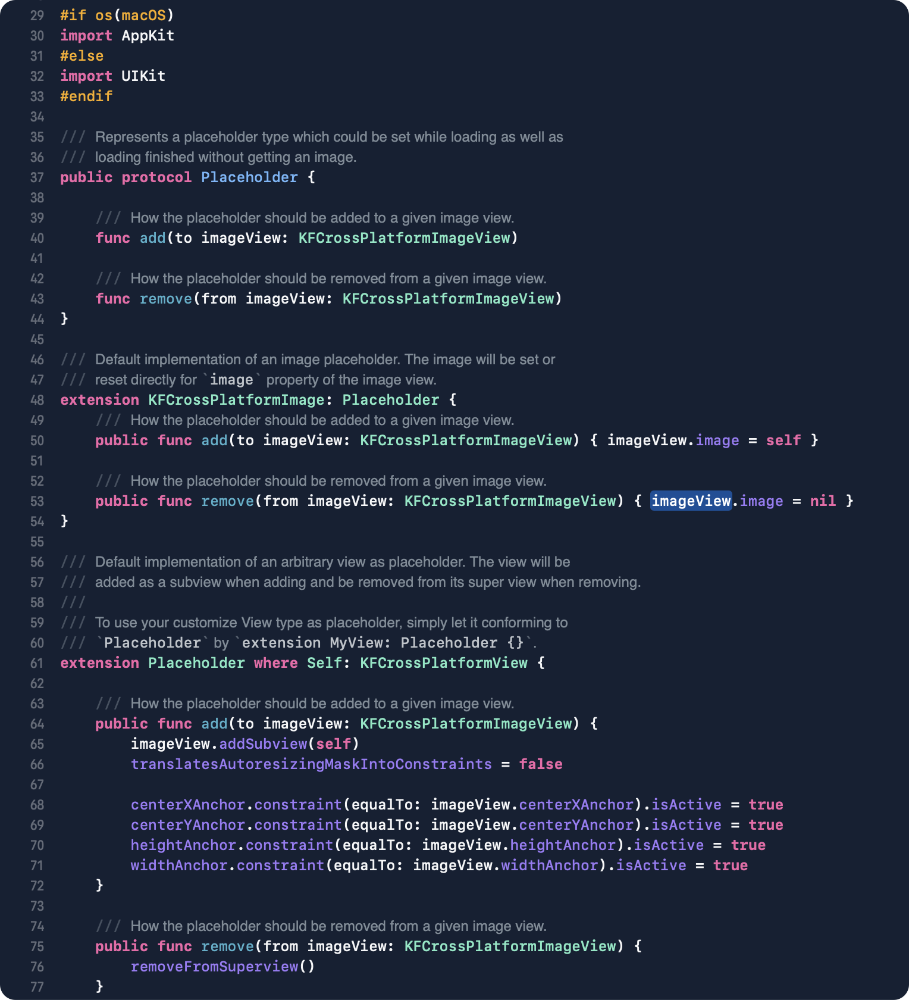

# Xcode Tailwind Theme

Xcode dark theme using [TailwindCSS](https://tailwindcss.com) [colors](https://tailwindcss.com/docs/customizing-colors). 

Here's how Xcode's editor look with this theme: 

Theme panel: 

